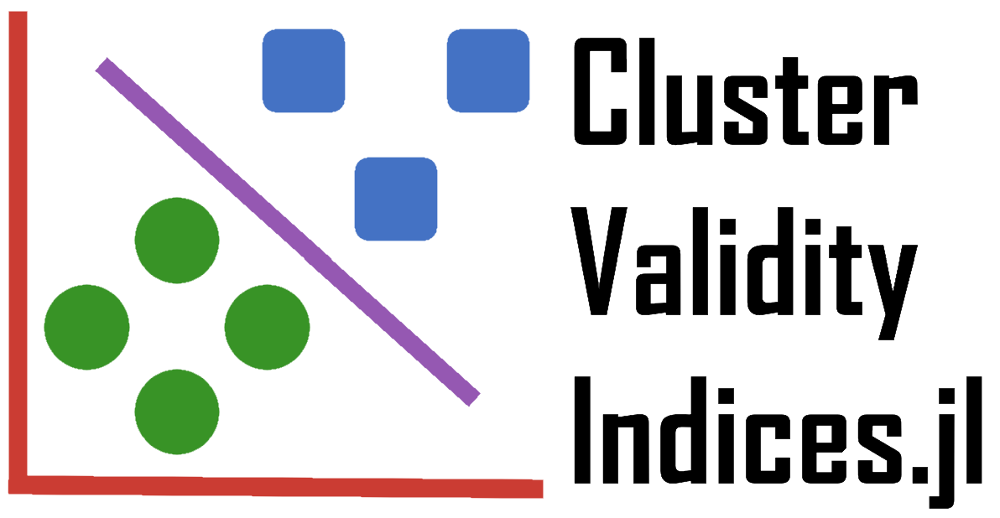

---

# ClusterValidityIndices.jl

These pages serve as the official documentation for the ClusterValidityIndices.jl Julia package.

Cluster Validity Indices (CVI) tackle the problem of judging the performance of an unsupervised/clustering algorithm without the availability of truth or supervisory labels, resulting in metrics of under- or over-partitioning.
Furthermore, Incremental CVIs (ICVI) are variants of these ordinarily batch algorithms that enable an online and computationally tractable method of evaluating the performance of a clustering algorithm as it clusters while being numerically equivalent to their batch counterparts.

The purpose of this package is to provide a home for the development and use of these CVIs and ICVIs.

See the [Index](@ref main-index) for the complete list of documented functions and types.

## Manual Outline

This documentation is split into the following sections:

```@contents
Pages = [
    "getting-started/what-are-cvis.md",
    "getting-started/basic-example.md",
    "man/guide.md",
    "../examples/index.md",
    "man/contributing.md",
    "man/full-index.md",
    "man/dev-index.md",
]
Depth = 1
```

The [Background](@ref) provides an overview of the problem statement of CVIs and what they are theoretically, while [Basic Example](@ref) steps through an single example workflow.

The [Package Guide](@ref) provides a tutorial to the full usage of the package, while [Examples](@ref examples) gives many sample workflows using a variety of CVI modules.

Instructions on how to contribute to the package are found in [Contributing](@ref), and docstrings for every element of the package is listed in the [Index](@ref main-index).
Names internal to the package are also listed under the [Developer Index](@ref dev-main-index).
